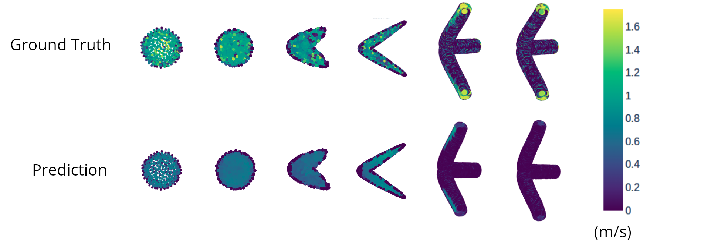

# A Framework for Generalized Steady State Neural Fluid Simulations



This is the repository for my [Master's Thesis](resources/A_Framework_For_Generalized_Steady_State_Neural_Fluid_Simulations.pdf) which lays out a framework for geometry agnostic neural fluid simulations built on top of the Ansys Simulation suite.

The dataset consists of over 3000 geometries from 4 geometry classes and 3400 steady state fluid simulations. 

There are 3 core elements to this project:
- A fully automated geometry generation and fluid simulation pipeline written in Python.

- A batch solution postprocessing routine that cleans and formats solution data for PyTorch model ingestion.

- Geometric deep learning model definitions and routines for training and hyperparameter searches using Optuna.

## Next Steps and Open Problems

There are plenty of areas for further research and collaboration:

- **Graph Neural Networks**
  - Due to scope constraints I did not conduct any experiments with GNN's however the infrastructure is in place train graph models.

- **Larger models**
  - I was limited to 24GB GPU ram when training models, it is worth exploring if bigger models yield better performance.

- **Geometry generation**
  - This project used pre-defined templates for generating the geometries. Generating more random and complex geometries will benefit modeling training.

- **Post processing and meshing**
  - This project utilized tetrahedral elements for the finite element mesh, mainly due to the fact that it was easier to write a custom mesh parser for tet elements. Modern simulations use more complex elements, which tend to yield better results. Updating the postpressor code to handle more complex elements will allow use of those elements in the simulation and improve the simulation quality.

- **Restricting the regression task to the inlets and outlets**
  - The experiments in the thesis looked at the full volume of the fluid domain, however many times the engineer is only concerned with the values on the inlets and outlets of the domain. There are flags that be turned on to restrict the fluid domain and change the regression task of the model. This was not explored in the thesis experiments but the functionality is present.

- **Enhanced simulation QC**
  - The post processing looks at the residuals to evaluate the simulation quality, however another metric that should be evaluating the continuity equation at the inlets and outlets to validate the conservation of mass.

- **Deeper analysis of model behavior**
  - Taking a closer look at model performance to understand where it succeeds and fails and use that feedback to craft better performing models

## How to Use this Repo
- To execute any routine (geometry generation, simulation, training) use the python scripts located in the scripts folder. The folder is structured so that you can call everything from the top level project folder using the -m flag (and also drop the .py from the script file). 
  - For Example:

    ```
    python -m scripts.sim.generation.run_sims
    ```
  - Each script is paired with a json file to manage config and filepaths.

<br>

- There are a few key flows:
  - Geometry Creation:
    - Geometries are generated programmatically using SpaceClaim - a CAD modeling tool within the Ansys suite. To generate geometry, take one of the python scripts in the sim/spaceclaim_scripts folder and run it in the SpaceClaim python terminal.

  - Simulation Generation And Post Processing:
    - Simulations are generated using an orchestration script that opens Ansys and runs a script in the WorkBench python terminal. 

    - Once the simulations have been generated, run the cleaning and post-processing scripts. These will remove any simulations that failed and will also map the solution files into ML friendly format.
      - Sequence:

        - [Generate the range of fluid params if you want your own](
          scripts/sim/generation/generate_flow_params.py)

        - For Each Geometry Class
          - [Run the batch of simulations](/scripts/sim/generation/run_sims.py)
          - [Clean the simulations](/scripts/sim/postprocessing/clean_sims.py)
          - [Map the data to a ML friendly format](scripts/sim/postprocessing/generate_geometry_data.py)

        - Once you have your own dataset:
          - [Split the dataset](/scripts.data.split_dataset.py)
          - [Create the scalers](/scripts/data/generate_scalers.py)

  - Model Training
    - There are scripts for hyperparameter search and full training runs.
    
    - To use the ConvPoint model, go to the [convpoint folder](neural/models/convpoint) and run the `download_convpoint.sh` script to clone the repo. Once installed make the changes called out [here](#finer-points).

    - To use the Minkowski Engine Model - follow the install instructions laid out in the [repo](https://github.com/NVIDIA/MinkowskiEngine)

- Data:
  - If you want access to the dataset, email me at steve.guerin13[at]gmail.com. I can provide a S3 URL. The simulation dataset is about 180GB total.


## Repository Structure
- Modules:

  - **data**: Functions for manipulating and visualizing simulation data.

  - **neural**: Model and DataSet class definitions as well as evaluation utilities.

  - **sim**: Functions and routines for generating geometry and simulation data in Ansys.

- Scripts:

  - **scripts**:

    - **data**: Manage the generated simulation data, create scalars, and evaluate the dataset.

    - **eval**: Measure the model performance.

    - **sim**: Generate and postprocess simulation data.

    - **train**: Run hyperparameter search and training routines.

    - **visualization**: Visualize model outputs.

  - **tests**:
    - ** these need to be updated with new data

- Other:
  - **outputs**: Target location for summary statistics and experimentation results.
  - **resources**: Docs used as references in creating this project.
  - **env**: conda environment yaml files for running the ConvPoint and Minkowski engine networks


## A Few Things to Note
- This repo went through a significant refactor to make it ready for public consumption. I have tested most of the major scripts and flows, but there may be things that slipped through the cracks. Just file an issue or submit a PR.

- There are still some TODO's sprinkled throughout the code, I will get to those when I can, or feel free to grab one and submit a PR.


## Dataset Folder Structure

- Data:
  - train
    - geo_class_1
      - sim_1
        - sim_data
      - ...
    - geo_class_2
      - ...
  
  - val:
    - ...

  - scalers:
    - std
      - scaler_data
    - ndim
      - scaler_data


## Finer Points


### ConvPoint

The ConvPoint GitHub Repo is not structured in a way that allows for direct import, there are a few tweaks that need to be made in order to use it in this project:

- In layer_base.py override the nearest neighbors import with this path

```
# providing an absolute path to the convpoint library
import sys
nn_path = os.path.join(os.getcwd(),"neural","models",
                        "convpoint","ConvPoint","convpoint",
                        "knn","lib","python", 
                        "KNN_NanoFLANN-0.0.0-py3.9-linux-x86_64.egg")
sys.path.append(nn_path)
import nearest_neighbors

```

- In pool.py and conv.py update the import to use the absolute import path

```
from neural.models.convpoint.ConvPoint.global_tags import GlobalTags
if GlobalTags.legacy_layer_base():
    from neural.models.convpoint.ConvPoint.convpoint.nn.legacy.layer_base import LayerBase
else:
    from neural.models.convpoint.ConvPoint.convpoint.nn.layer_base import LayerBase
```
